## 项目说明

​		本项目是学校“互联网软件开发技术与实践”课程项目，项目要求为使用所学知识实现一个秒杀系统。此项目设计为学校的活动提供一个简单的抢票系统、解决高并发下的一系列问题，主要用于学习。涉及的技术栈：SpringBoot、Mybatis-Plus、Shiro、Thymeleaf、BootStrap等，以及java基础，计算机基础知识。

### 部署说明

项目要求拥有以下环境：

- JDK1.8
- Tomcat 9(SpringBoot已经自带)
- MySQL 5.6
- Maven 3.6.x
- Redis 3.0.5

开发工具为 IntelliJ IDEA 2020.1.2

项目所使用的数据库信息已经导出作为sql文件，执行sql脚本根据需求修改项目配置文件application.yml即可启动

后台管理系统地址：https://github.com/Hataha/ticket-grabbing-system


## 目标需求

​		在大学中很多校园活动会引发很多学生的关注，例如开学典礼、新年晚会、火爆的社团活动等，因为场地有限，需要通过门票限制客流，但很多活动都采取线下发放门票的方式。这样的方式麻烦而又低效，此项目拟实现一个线上的校园活动抢票系统。

​		该系统分为两部分：**后台的管理系统**以及**前台的抢票系统**，后台管理系统由学校管理员使用，负责活动的发布与取消，以及对参与活动学生的管理；前台抢票系统由学生使用，负责查看活动和获取门票。

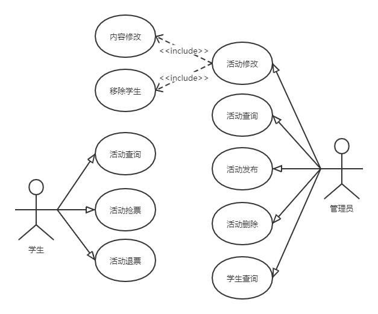

<center>用例图<center/>

其中最核心的部分是抢票业务，抢票要求如下：

- 可以允许请求不严格按照顺序到来
- 可以允许没有处理到所有的请求
- 不允许出现超卖（多给票）
- 不允许出现重复抢票
- 不允许出现未在规定时间内的成功抢票记录


## 技术实现


### 系统架构

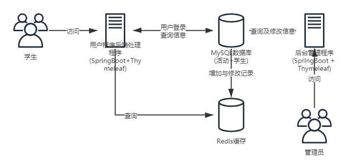

<center>总体架构<center/>

​		总体架构如图所示，底层数据库为MySQL单机数据库，配备有Redis缓存供秒杀业务读取以提高效率。前台抢票程序和后台管理系统均采用SpringBoot+Thymeleaf的组合，不使用前后端分离开发，访问同一个数据库

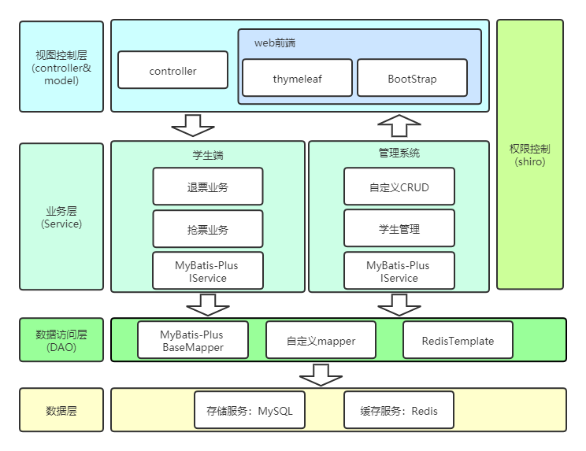

<center>系统架构<center/>

​		本项目的前台系统和管理系统遵循MVC架构，数据层使用MySQL数据库和Redis缓存，数据访问层使用Mybatis-Plus提供的BaseMapper完成数据的增删改查，同时可以自定义mapper完善数据访问功能，使用SpringBoot集成的RedisTemplate操作Redis缓存。业务层分为学生端和后台系统，他们均使用mybatis-plus提供的IService进行基本的增删改查，同时自定义抢退票业务、学生管理业务。视图层和控制层使用thymeleaf模板引擎结合前后端，使用BootStrap作为前端UI框架。权限控制使用shiro框架实现。


### 系统实现

#### 数据库表设计

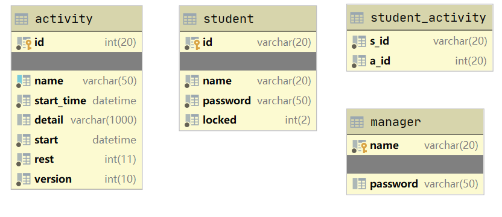


<center>数据库设计<center/>

该程序数据库设计较为简单

**表名：activity  活动表：记录活动信息**

| 字段       | 说明             |
| ---------- | ---------------- |
| id         | 主键自增id       |
| name       | 活动名称         |
| start_time | 活动开始抢票时间 |
| detail     | 活动的简介信息   |
| start      | 活动开始时间     |
| rest       | 活动剩余票数     |
| version    | 乐观锁版本号     |

**表名：student  学生表 ：记录学生信息**

| 字段     | 说明                              |
| -------- | --------------------------------- |
| id       | 主键，学号                        |
| name     | 学生姓名                          |
| password | 学生密码，存储经MD5加密后的字符串 |
| locked   | 学生锁定状态 0为未锁定1为锁定     |

**表名：student_activity  学生活动映射表 ：可以理解为抢票的订单信息，一条记录为学生拿到的一张票**

| 字段 | 说明     |
| ---- | -------- |
| s_id | 学生学号 |
| a_id | 活动id   |

**表名：manager 管理员表，记录管理员信息**

| 字段     | 说明                                    |
| -------- | --------------------------------------- |
| name     | 主键，管理员用户名                      |
| password | 管理员登录密码，存储经MD5加密后的字符串 |


#### 身份权限认证

##### 登录

- 前台程序使用学生学号和密码登录，管理系统使用管理员名称和密码登录
- 密码经过MD5一次加密
- 登录业务使用shiro框架实现

shiro的加密配置如下

```java
@Bean("hashedCredentialsMatcher")
public HashedCredentialsMatcher hashedCredentialsMatcher() {
    HashedCredentialsMatcher credentialsMatcher = new HashedCredentialsMatcher();
    //指定加密方式为MD5
    credentialsMatcher.setHashAlgorithmName("MD5");
    //加密次数
    credentialsMatcher.setHashIterations(1);
    credentialsMatcher.setStoredCredentialsHexEncoded(true);
    return credentialsMatcher;
}
```

登录通过重写shiro的认证方法完成

```java
//认证，把登录得student信息保存起来
@Override
protected AuthenticationInfo doGetAuthenticationInfo(AuthenticationToken authenticationToken) throws AuthenticationException {
    UsernamePasswordToken token = (UsernamePasswordToken) authenticationToken;
    Student student = studentService.getById(token.getUsername());

    if(student == null){
        return null;
    }
    else{
        return new SimpleAuthenticationInfo(student,student.getPassword(),getName());
    }
}
```


##### 身份认证

通过配置shiro的filterMap，此程序的所有url请求均需要登录才能完成(静态资源，首页，登录请求除外)

```java
Map<String, String> filterMap = new LinkedHashMap<>();
filterMap.put("/logout","logout");
//无需认证的请求
filterMap.put("/static/**","anon");
filterMap.put("/css/**","anon");
filterMap.put("/noAuth","anon");
filterMap.put("/js/**","anon");
filterMap.put("/img/**","anon");
filterMap.put("/error","anon");
filterMap.put("/","anon");
filterMap.put("/doLogin","anon");
//所有请求均要认证
filterMap.put("/**","authc");
```


#### 秒杀接口设计

秒杀接口设计是本程序的核心，秒杀接口设计的总体目标可以分为两个**削峰**和**安全**，此程序采用了以下方法来设计秒杀接口

- 前端逻辑过滤请求
- 使用令牌桶算法进行限流
- 读取redis缓存信息判断条件过滤请求
- 配置乐观锁，防止超卖

总体流程如下：

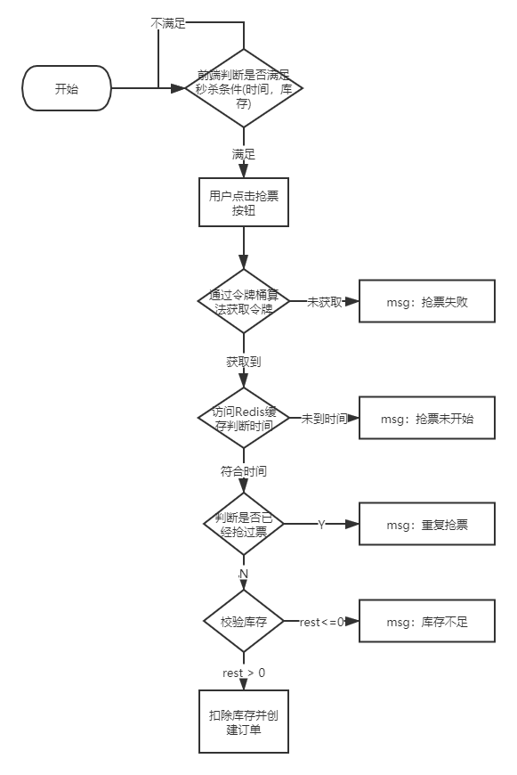

<center>抢票流程<center/>


##### 前端逻辑过滤请求

当用户进入活动详情页时model中带有活动信息，可以简单使用此时刷新的活动信息作为第一层的过滤：只有当库存满足、没有选过活动、时间到达三个条件都满足的时候才能显示抢票按钮

```xml
<!--前端获取的系统当前时间可以实时更新-->
<button id="grab-button" th:hidden="${activity.getRest()>0 and !selected and activity.getStartTime().getTime() <= new java.util.Date().getTime()}?'false':'true'" class="btn btn-sm btn-success" data-toggle="modal" data-target="#grabModal">抢票</button>
```

##### 使用令牌桶算法进行限流

此程序可以容忍丢弃一些请求，可以使用令牌桶算法进行限流

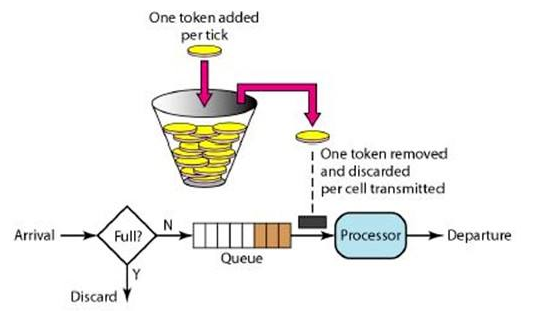


​		令牌桶算法的原理是系统以恒定的速率产生令牌，然后把令牌放到令牌桶中，令牌桶有一个容量，当令牌桶满了的时候，再向其中放令牌，那么多余的令牌会被丢弃；当想要处理一个请求的时候，需要从令牌桶中取出一个令牌，如果此时令牌桶中没有令牌，那么则拒绝该请求。令牌桶算法在程序中通过Google的guava实现，桶大小设置为30，尝试获取令牌时间设置为5s

```java
//创建令牌桶实例，一次可以进来20个请求
private RateLimiter rateLimiter = RateLimiter.create(30);

//=======================================================

//加入令牌桶算法限流
//如果五秒内尝试获得令牌失败，则直接过滤请求
if(!rateLimiter.tryAcquire(5, TimeUnit.SECONDS)){
    model.addFlashAttribute("msg","抢票失败，请稍后重试请重试");
    return "redirect:/activity/toDetailPage/" + aid;
}
```


##### **读取redis缓存信息判断条件过滤请求**

本项目把活动开始抢票时间添加入redis缓存，这样在读取数据库之前可以先通过抢票时间过滤一部分请求，为数据库分担压力。记录信息在创建活动时就写入redis

```java
/**
 * 通过redis查询是否到合法时间
 */
@Override
public boolean checkTime(int aid) {
    return Long.parseLong(Objects.requireNonNull(redisTemplate.opsForValue().get("kill" + aid)))
        <= new Date().getTime();
}
```

##### 配置乐观锁，防止超卖

为了防止高并发下数据库的读写出现问题，此项目使用乐观锁来解决并发问题，扣除库存时，从数据库读取数据获得数据的版本号，写数据时需要连同版本号一同更新，如果写入时发现版本号与读取时不一致，则证明数据已过期。乐观锁通过Mybatis-Plus的乐观锁插件实现写数据时自动更新

```java
//实体类属性
@TableField(fill = FieldFill.INSERT)
@Version
private int version;

/**
 * 这个类可以用来处理创建更新操作时数据库的一些自动行为，比如自动更新字段
 * 自动插入字段等
 */
@Component
public class MyMetaObjectHandler implements MetaObjectHandler {
    @Override
    public void insertFill(MetaObject metaObject) {
        //新增活动数据时版本号字段自动设置为0
        this.setFieldValByName("version",0,metaObject);
    }
}

/**
 * mybatisplus配置类
 * 配置乐观锁插件
 * 配置分页插件
 */
public class MyBatisPlusConfig {
    @Bean
    public MybatisPlusInterceptor mybatisPlusInterceptor(){
        MybatisPlusInterceptor interceptor = new MybatisPlusInterceptor();
        // 乐观锁插件
        interceptor.addInnerInterceptor(new OptimisticLockerInnerInterceptor());
        return interceptor;
    }
}

```


## 运行效果展示

### 登录页面

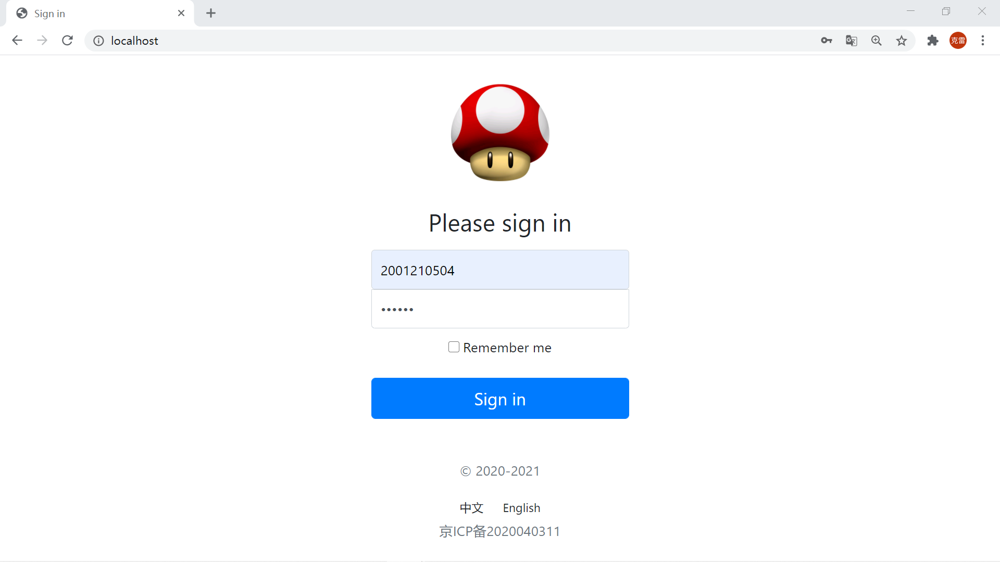

<center>登录页<center/>

未登录直接访问请求会被拦截

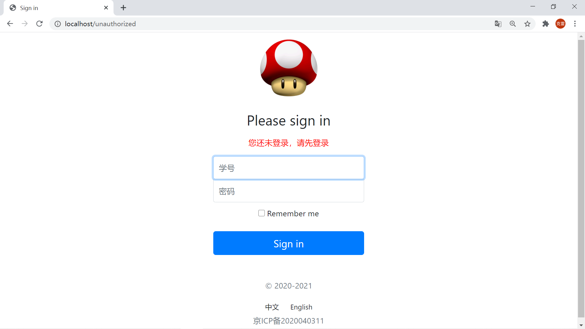

<center>请求拦截<center/>
    
</center>


### 后台管理系统

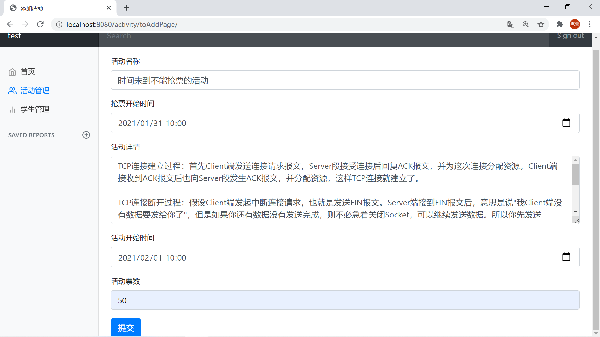

<center>添加活动<center/>

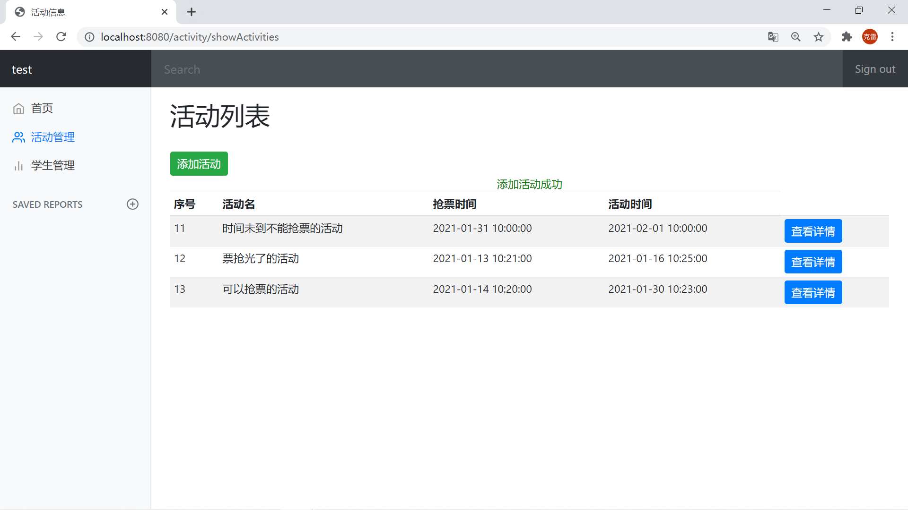

<center>活动页面<center/>

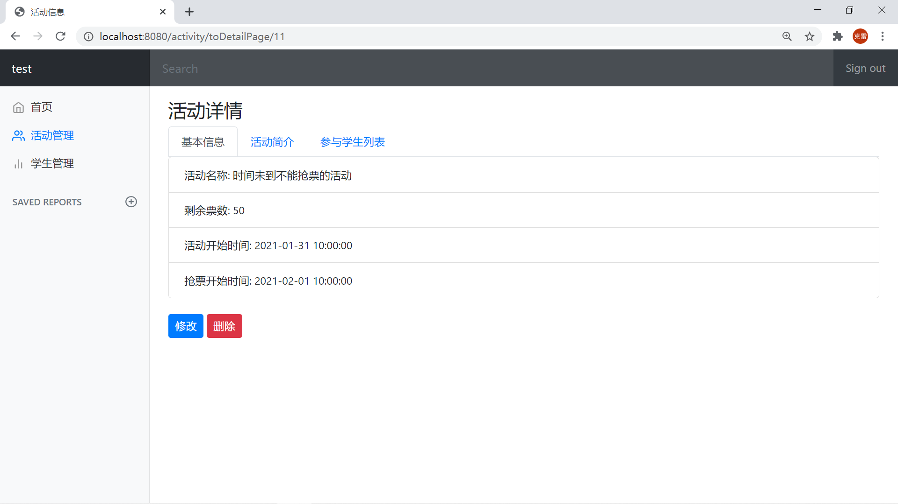

<center>活动详情<center/>

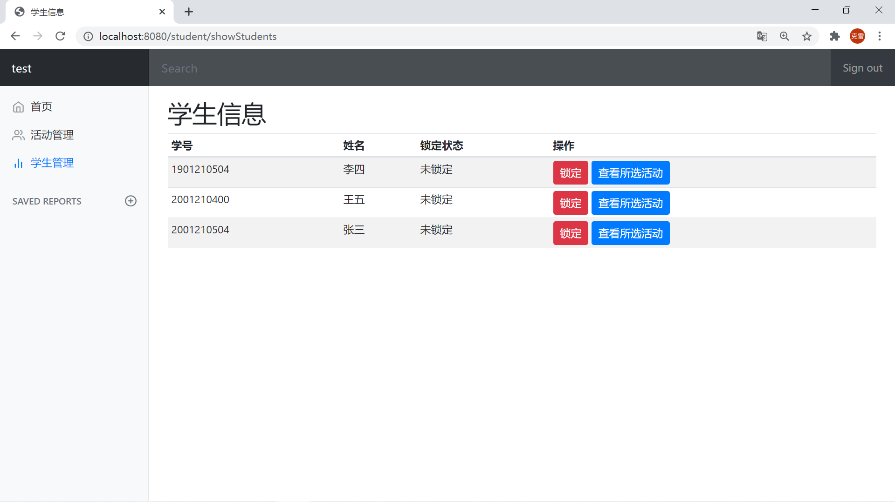

<center>学生管理<center/>

### 前台抢票程序

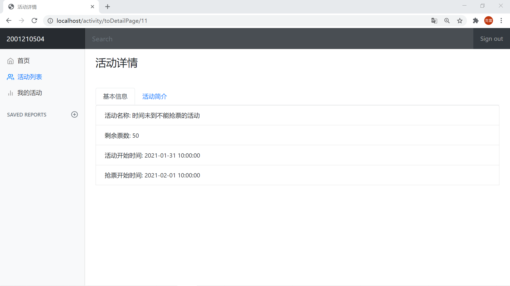

<center>不能抢票<center/>

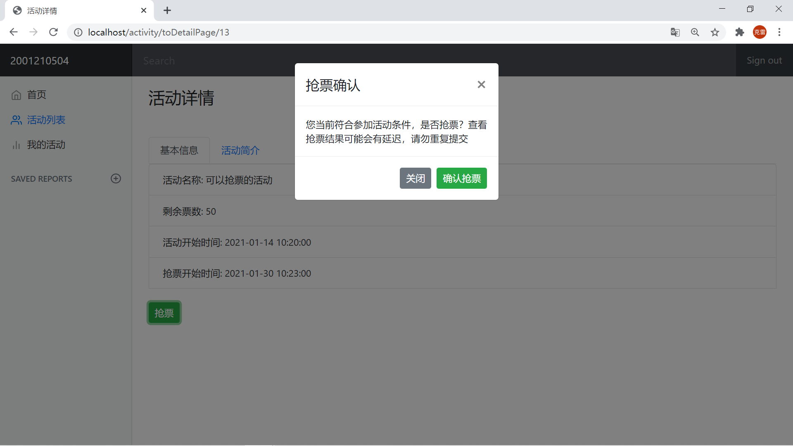

<center>可以抢票<center/>

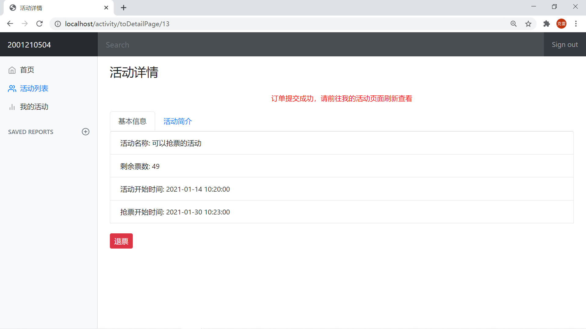

<center> 抢票成功<center/>

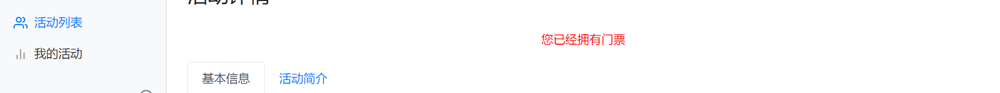

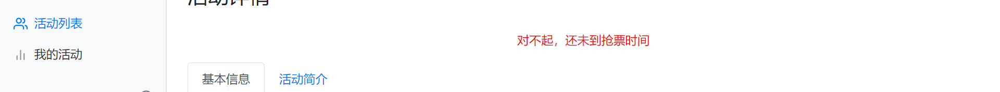

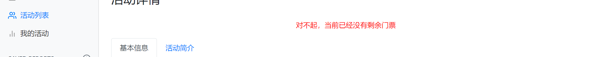

<center>拦截各种非法请求和意外请求<center/>


## 问题与改进

此项目因为技术原因以及时间原因，存在很多值得改进的地方

- 抢票请求通过ajax异步提交，避免刷新网页带来的开销
- 可以通过redis缓存增加重复提交抢票请求的限制，避免脚本抢票带来的不公平
- 秒杀接口可以进行隐藏，使用用户id和活动id生成接口的token，使用此token进行请求抢票
- 学生列表和活动列表可以分页
- 活动详情目前只能添加文字，可以改为富文本编辑器添加富文本
